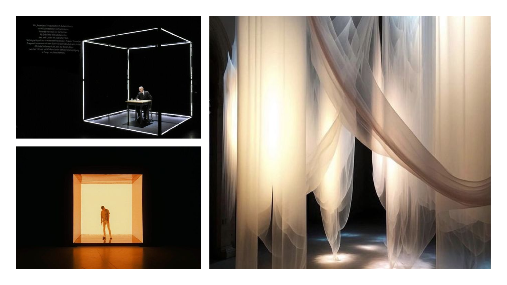
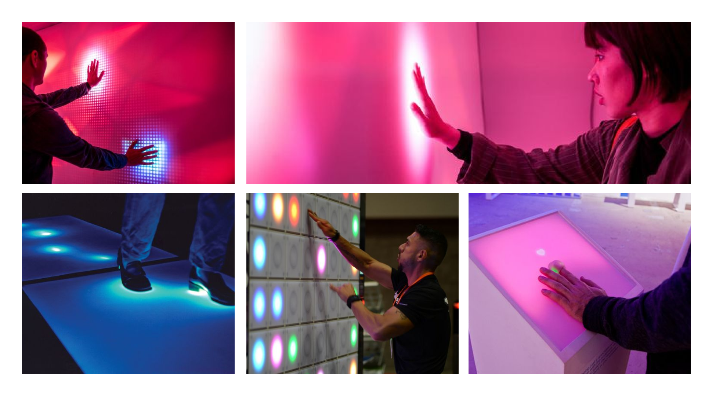

# Scénarisation d'un projet multimédia

## L'idée

### Concept
Dans une installation interactive divisée en deux pièces, deux utilisateurs sont chacun devant un clavier tactile. Lorsqu'un utilisateur appuie sur une touche, une lumière s'illumine sur le clavier de l'autre. Si les deux utilisateurs touchent la même touche, une note de musique résonne dans les deux espaces.

### Schéma
````mermaid
graph TD;
    A[Utilisateur 1] -->B{Appuie sur une touche}
    B --> F[Lumière s'illumine sur le clavier 2]
    E --> |Même touche?| C[Note de musique résonne dans les deux pièces]
    B --> |Même touche?| C
    D[Utilisateur 2] -->E{Appuie sur une touche}
    E --> G[Lumière s'illumine sur le clavier 1]
````

### Objectif
L'objectif est simple : écrire un mot ensemble. Chaque pression sur une touche doit être réfléchie et enchaînée pour créer une harmonie. Lorsqu'ils parviennent à composer un mot successif, une douce mélodie retentit, les encourageant à continuer.

La tension monte alors qu'ils tentent de synchroniser leurs gestes, découvrant la magie de la collaboration à travers la musique et la lumière. La pièce se remplit de joie et d’énergie, transformant un simple mot en une véritable œuvre d’art collective.

## Moodboard

### Palette de couleurs


### Pièces


- Éclairages neutres (blanc/beige) tout autour de la pièce pour mettre l'emphase sur le clavier
- Murs et sols complètement noirs pour encore une fois poser l'attention sur le clavier
- Les pièces sont séparées par un rideau à peine translucent pour laisser faiblement paraître les mouvements de l'autre personne et reproduire une certaine intimité

### Clavier tactile


- Le clavier tactile est posé sur un piédestal avec un fond rose
- Les touches s'illumine avec un éclairage bleu et un effet flou lorsque appuyées
- Si elles sont appuyées en même temps par les deux utilisateurs, elles s'illuminent en rose
- Choix du rose et des effets flous pour reproduire la connection humaine 

### Audio
[Peaceful Solitude - Eternal Warriors](https://www.youtube.com/watch?v=K0EITpmtfZ0)<br>
- Les notes de musique sont mêlées à la musique d'ambiance
- Notes qui jouent en boucle

[Cosmic Harmony - Connectionist](https://www.youtube.com/watch?v=vYFaDiqx-e8)
- Musique d'ambiance relaxante pour
- Simple afin de mettre de l'avant les notes qui jouent lorsque les utilisateurs appuient sur la même touche

## Technologie
